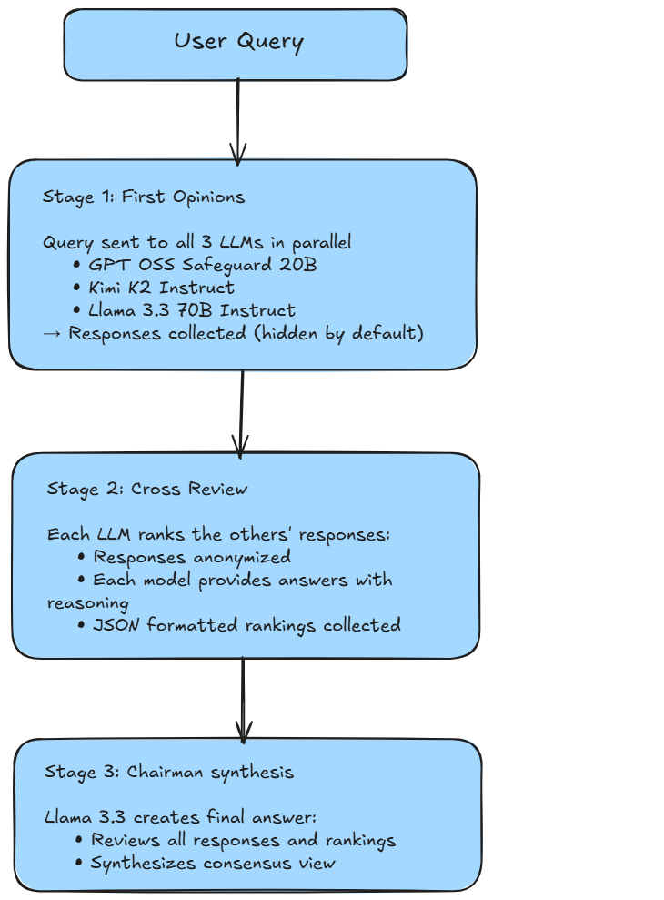

# LLM Council

> A multi-LLM consensus system with a modern chat interface that leverages collective intelligence from multiple AI models through a three-stage pipeline: independent responses, cross-review, and chairman synthesis.


## Overview

LLM Council is a **conversational web application** that queries multiple Large Language Models (LLMs) simultaneously, has them review each other's responses, and produces a final synthesized answer from a designated "Chairman" model. This approach combines the strengths of different AI models to provide more comprehensive and balanced responses.

### How It Works



## Features

- **Multi-Model Consensus**: Queries 3 different LLMs simultaneously
- **Cross-Review System**: Models evaluate each other's responses
- **Chairman Synthesis**: Final answer combines best insights from all models
- **Chat Interface**: Modern conversational UI with message history
- **Persistent Storage**: Conversations saved in browser localStorage
- **Collapsible Details**: Expand to view individual responses and rankings
- **Real-time Progress**: Visual feedback for each processing stage
- **Auto-Save**: Conversation history automatically preserved
- **Clear Chat**: Start fresh conversations anytime
- **HuggingFace Router**: Uses HuggingFace's router with Groq endpoints for fast inference

## Stack

### Backend
- **FastAPI**: Modern Python web framework
- **OpenAI SDK**: Compatible client for HuggingFace router
- **python-dotenv**: Environment variable management
- **Uvicorn**: ASGI server
- **No Pydantic**: Uses native Python dataclasses

### Frontend
- **React 18**: UI library with hooks
- **Vite**: Build tool and dev server
- **Axios**: HTTP client
- **localStorage API**: Client-side conversation persistence

### AI Models (via HuggingFace Router)
- `openai/gpt-oss-safeguard-20b:groq`
- `moonshotai/Kimi-K2-Instruct-0905:groq`
- `meta-llama/Llama-3.3-70B-Instruct:groq` (also serves as Chairman)

## Prerequisites

- Python 3.8+
- Node.js 16+
- HuggingFace API token

## Installation

### 1. Clone the Repository

```bash
git clone <your-repo-url>
cd llm-council
```

### 2. Backend Setup

```bash
cd backend

# Create virtual environment
python -m venv venv

# Activate virtual environment
# On Windows:
venv\Scripts\activate
# On macOS/Linux:
source venv/bin/activate

# Install dependencies
pip install -r requirements.txt

# Create .env file
cp .env.example .env
```

Edit `backend/.env` and add your HuggingFace token:

```env
HF_TOKEN=your_huggingface_token_here
HOST=0.0.0.0
PORT=8000
CORS_ORIGINS=http://localhost:3000,http://localhost:5173
```

### 3. Frontend Setup

```bash
cd ../frontend

# Install dependencies
npm install

# Create .env file
cp .env.example .env
```

The frontend `.env` should contain:

```env
VITE_API_URL=http://localhost:8000
```

## Running the Application

### Start Backend

```bash
cd backend
python -m uvicorn app.main:app --reload --host 0.0.0.0 --port 8000
```

The API will be available at `http://localhost:8000`

API Documentation: `http://localhost:8000/docs`

### Start Frontend

```bash
cd frontend
npm run dev
```

The UI will be available at `http://localhost:3000` (or the port shown in terminal)

## Usage

1. Open your browser to `http://localhost:3000`
2. Type your question in the chat input at the bottom
3. Press Enter or click the send button (➤)
4. Watch the three-stage processing:
   - **Stage 1**: Initial responses from all models
   - **Stage 2**: Cross-review and ranking
   - **Stage 3**: Chairman synthesis
5. View the final synthesized answer in the chat
6. Click **"▶ View Individual Responses & Rankings"** to see:
   - Individual model responses (tabbed view)
   - Cross-review rankings with reasoning
   - Processing time
7. Your conversation history is automatically saved in your browser
8. Click **"🗑️ Clear Chat"** to start a new conversation
9. Continue the conversation - context is maintained!

## Project Structure

```
llm-council/
├── backend/
│   ├── app/
│   │   ├── __init__.py          # Package init
│   │   ├── main.py              # FastAPI app & endpoints
│   │   ├── config.py            # Configuration (no Pydantic)
│   │   ├── models.py            # Dataclass models
│   │   ├── llm_client.py        # HuggingFace API client
│   │   └── pipeline.py          # 3-stage processing logic
│   ├── requirements.txt         # Python dependencies
│   ├── .env.example            # Environment template
│   ├── start.sh                # Linux/Mac start script
│   └── start.bat               # Windows start script
│
├── frontend/
│   ├── src/
│   │   ├── components/
│   │   │   ├── ChatMessage.jsx      # Individual chat messages
│   │   │   ├── ChatInput.jsx        # Bottom input component
│   │   │   └── LoadingStages.jsx    # Progress indicator
│   │   ├── services/
│   │   │   └── api.js               # API client
│   │   ├── App.jsx                  # Main app with chat logic
│   │   ├── App.css                  # Complete chat styling
│   │   └── index.jsx                # React entry point
│   ├── index.html               # HTML template
│   ├── package.json             # Node dependencies
│   ├── vite.config.js           # Vite configuration
│   └── .env.example            # Environment template
│
├── README.md                    # This file
└── .gitignore                  # Git ignore rules
```

## API Endpoints

### `GET /`
Root endpoint with API information

### `GET /health`
Health check endpoint
```json
{
  "status": "healthy",
  "models_configured": 3,
  "hf_token_set": true
}
```

### `POST /query`
Submit a query to the LLM Council

**Request:**
```json
{
  "query": "What is the meaning of life?"
}
```

**Response:**
```json
{
  "query": "What is the meaning of life?",
  "stage_1_responses": [
    {
      "model_name": "openai/gpt-oss-safeguard-20b:groq",
      "response": "...",
      "model_id": "A"
    },
    ...
  ],
  "stage_2_reviews": [
    {
      "reviewer_model": "openai/gpt-oss-safeguard-20b:groq",
      "rankings": [
        {
          "response_id": "B",
          "rank": 1,
          "reasoning": "..."
        },
        ...
      ]
    },
    ...
  ],
  "stage_3_final": {
    "content": "...",
    "chairman_model": "meta-llama/Llama-3.3-70B-Instruct:groq"
  },
  "processing_time": 12.34
}
```

## Data Storage

### Conversation Persistence

Conversations are stored in the browser's `localStorage`:

```javascript
// Storage key: 'llm-council-conversation'
[
  {
    "id": 1707408123456,
    "type": "user",
    "content": "What is quantum computing?",
    "timestamp": "2024-02-08T10:15:23.456Z"
  },
  {
    "id": 1707408145678,
    "type": "assistant",
    "content": "Quantum computing is...",
    "data": {
      // Full pipeline response for expandable details
      "stage_1_responses": [...],
      "stage_2_reviews": [...],
      "stage_3_final": {...},
      "processing_time": 25.3
    },
    "timestamp": "2024-02-08T10:15:45.678Z"
  }
]
```


## Customization

### Adding More Models

Edit `backend/app/config.py`:

```python
class Settings:
    def __init__(self):
        self.model_1 = os.getenv("MODEL_1", "your-model-1")
        self.model_2 = os.getenv("MODEL_2", "your-model-2")
        self.model_3 = os.getenv("MODEL_3", "your-model-3")
        self.chairman_model = os.getenv("CHAIRMAN_MODEL", "your-chairman")
```


### Adjusting Model Behavior

Edit prompts in `backend/app/llm_client.py`:
- Initial response system prompt
- Review ranking instructions
- Chairman synthesis guidelines


## License

This project is open source and available under the MIT License.


**Built with claude using FastAPI, React, and the power of collective AI intelligence**

🏛️ **LLM Council** - *Where multiple minds create better answers*